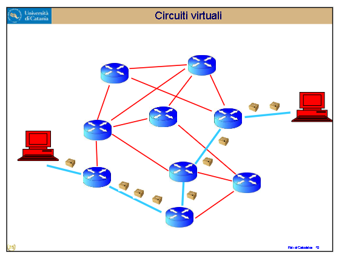

# RETI DI CALCOLATORI

Ogni pacchetto deve avere un indirizzo -> indirizzamento. Deve avvenire ogni volta che si manda un pacchetto, a differenza del circuito il cui percorso veniva definito una sola volta e rimaneva fino alla chiusura di esso. Come unire le cose?  

## Circuiti virtuali  

I router non ricalcolano così ogni volta il percorso migliore. All'inizio creo la strada e mando un pacchetto informatore. Esso informa il destinatario di essere il primo di una serie di "2000" e che i seguenti saranno cadenziati in una certa maniera, che il flusso di dati sarà di 2Mb/s etc. Quindi chiede al router se "ce la fa"; se può reggere il flusso e coordinarlo. Se la risposa è positiva, si passa al passo successivo.  
Il router ha un processore, quindi una larghezza di banda: ovvero quanti bit può spostare dall'entrata all'uscita per intervallo di tempo.  
Discorso tra Router economico da supermercato VS Router professionale di università.  
Gli serve una memoria veloce, ma anche una certa quantità di memoria fissa per bufferizzare i pacchetti non ancora spediti. Il router deve organizzarsi; di norma, non dovrebbero intasarsi.  

Oltre al valore medio si dice anche il valore di picco della trasmissione, per il semplice motivo che la trasmissione può variare in base al momento della giornata e ad un sacco di fattori: ad esempio, corso italia all'una di notte VS alle 13 ora di punta.  
In questo modo però comunque la trasmissione non è omogenea e se cade un nodo tutte le strade si interrompono. Il modem come identifica i flussi? Esistono identificatori standard, anche se non è una vera e propria tabella.  

## Livello applicativo  

Ovvero quello che ariva all'utente. Ci occuperemo soprattutto del modello CLIENT - SERVER.  
Server = Un processo sempre pronto e disponibile a ricevere richieste dal Client. L'indirizzo del Server dev'essere statico e fisso.  
L'ISP nel privato fa con il planning economico diversi piani; il piano business dove ti mettono l'IP statico e il piano economico dove te lo mettono dinamico "così non ci possono fare server". Dove si mette lo statico? Nei data servers. In essi si mettono anche gruppi di continuità, hardware di un certo peso e in grado di gestire aumento di utenti, con buona scalabilità del sistema, e possibilità di aggiungere hardware aggiuntivo in futuro.  
Il Client non deve per forza avere un indirizzo fisso, né essere sempre connesso a internet, NE' teoricamente essere connesso ad internet quando la richiesta viene processata dal server. Anche se di solito si fa, anche perché le richieste sono molto rapide per l'utente. Si fa solo per esempio se voglio risparmiare batteria, ma sono cose minime.  

I client (a differenza del modello P2P che non trattiamo in questo corso) non parlano mai fra di loro. Il Peer2Peer è un modello decentralizzato dove non esiste un server centrale né coordinamento; i peer comunicano fra di loro e possono entrare e uscire da soli autonomamente. Ma la gestione è un casino. P2P viene soprattutto usato per il file sharing, ma anche per le blockchains.  

