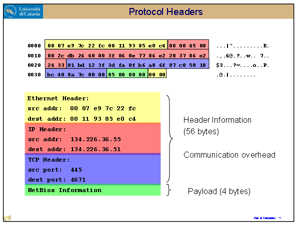
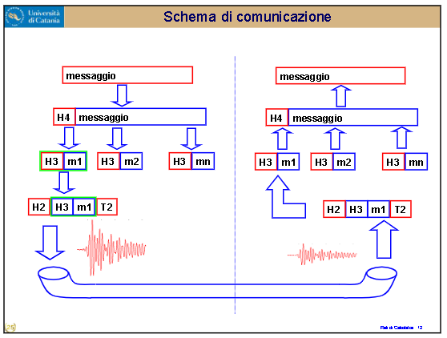
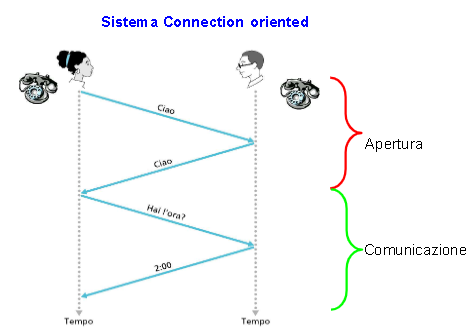
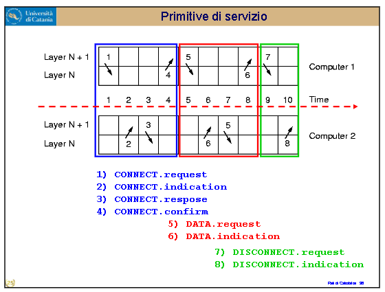
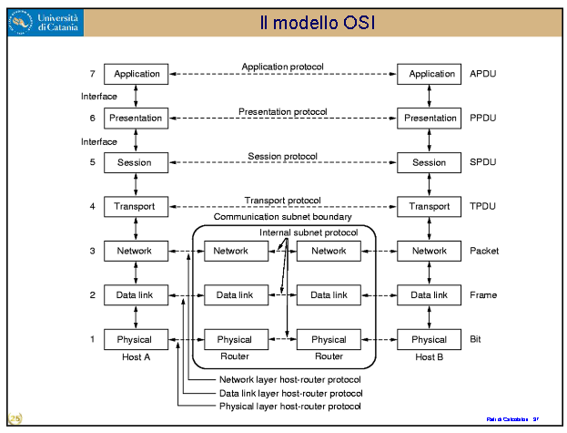
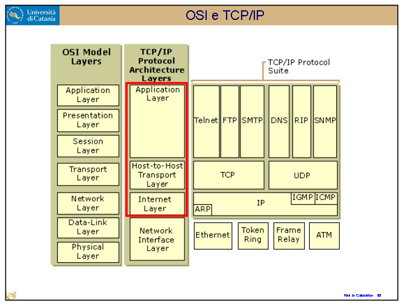
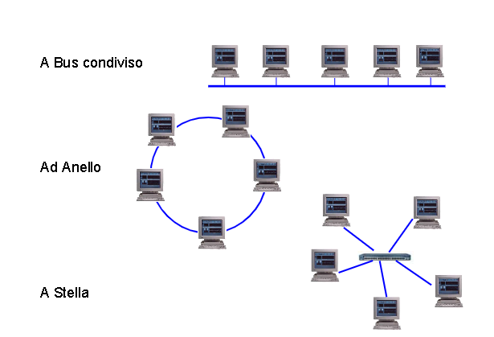

# RETI DI CALCOLATORI - 02

Si è parlato di protocolli per far comunicare più macchine. Un protocollo definisce il formato, l'ordine dei messaggi spediti e ricevuti tra entità di una rete, e azioni effettuate al momento della transazione e ricevuta. Tutta la attività di comunicazione su internet è governata da protocolli.

Serve quindi una struttura per controllare come trasformare i segnali in bit e viceversa, poi in blocchi di informazioni. Si è pensato quindi ad un **sistema a livelli**. Ogni livello comunica verticalmente e orizzontalmente, e ognuna di queste comunicazioni è governata e regolamentata da un protocollo. 

Per controllare se ci sono errori deve passare al livello giusto che controlli--> quindi un altro protocollo.
E' un sistema "a cipolla", come le scatole cinesi, una cosa dentro l'altra, e il messaggio o pacchetto di informazioni è la scatola più interna di tutte, il nucleo della cipolla. Oppure qualcuno che viaggia dentro una macchina che a sua volta è trasportata da un traghetto.

I livelli in verticali siamo abbastanza sicuri che funzionino, dipendono solo da una macchina; quelli in orizzontali, non c'è la certezza, perché è in COMUNICAZIONE: ci sono maggiori possibilità di fallire. Anche perché ogni volta che il messaggio viene ricevuto, le informazioni devono essere processate al livello fisico, che puntualmente fa casini. 

Quando comunica col livello inferiore, viene data una intestazione, che ai livelli superiori viene tolta. Come se ci fossero dei numeri di pagina per raccapezzarsi di cosa sia e di che si stia parlando. Indirizzi di mittente e ricevente. Il problema è che utilizzano un casino di spazio.

Il messaggio non può viaggiare da solo: ha bisogno del protocollo TCP. Ma il TCP non può viaggiare da solo, ha bisogno dell'IP. Che a sua volta ha bisogno dell'Ethernet. Tuttavia così, per spedire 4 bytes ne sto utilizzando 56 di informazioni necessarie.

Ecco una astrazione di come il messaggio passa dai livelli attraverso il mezzo fisico. (Il segnale fisico non arriverà mai perfettamente uguale a come è partito.) Quando il segnale viene recepito, la payload viene "aperta" in maniera tale da leggere e decifrare il messaggio contenuto in essa. 

---

--> Diciamo che l'utente voglia un canale di comunicazione (virtuale) tale che sia affidabile e privo di errori. Ciò è praticamente impossibile da garantire 100%. (Però ce se prova)

Il canale virtuale deve essere implementato utilizzando canali FISICI.

--> Un canale fisico può essere simplex, half-duplex, o full-duplex. 
    -> Il simplex è come un telecomando: invia un messaggio ma non riceve un ritorno che notifica il ricevimento. E' un "manda-messaggi cieco e sordo ai messaggi del ricevente". One way. Il telecomando non vede se il segnale è andato a buon fine.
    -> L'half-duplex è quando uno dei due dispositivi può sia trasmettere che ricevere.
    -> Il full-duplex è quando entrambi i dispositivi possono trasmettere e ricevere.

-> I messaggi a basso livello non possono essere di lunghezza arbitraria (?????)

-> Un trasmettitore veloce non deve sommergere un ricevitore lento
    -> Come se il prof facesse lezione in 5 minuti e noi non capissimo na mazza. Sta cosa non funzionerebbe, quindi si mette un protocollo in modo da far rendere conto al trasmettitore che si deve calmare

-> Bisogna determinare il percorso migliore(secondo quali criteri?) per arrivare a destinazione. Il peso va misurato in base al nostro obiettivo. Secondo il tempo, o lo spazio, o la comodità. Nelle tabelle interne della macchina c'è una metrica che classifica i "percorsi disponibili" e sceglie quale utilizzare in base a diversi criteri. Per esempio, un laptop connesso con il cavo LAN e ad un router WIFI velocissimo, sceglierà il cavo LAN fetente perché è più affidabile.

-> Bisogna garantire che l'ordine dei messaggi spediti debba essere uguale all'ordine dei messaaggi che la destinazione riceva. Ovvero, l'ordine di arrivo dei messaggi deve essere uguale a quello di spedizione.

--> DUE CATEGORIE DI COMUNICAZIONE:
    -> Connectionless vs Connection Oriented.
    -> Affidabile vs Non Affidabile.

Bisogna ricordare che anche le ricevute sono messaggi, e che possono essere persi. O essere ignorati.

Un canale può essere affidabile o meno. Se Alice manda la lettera, non siamo sicuri che essa arrivi a destinazione. Soluzione: ricevuta di ritorno. Ma anch'essa può essere persa. Quindi potremmo mettere un timer. "Entro tot tempo, se non ho ricevuto una risposta, rimando il messaggio. Ma deve essere un timer TARATO, altrimenti si incaglia in altro tipo di problemi, per esempio scambiare la ricevuta di un messaggio precedente con la ricevuta del messaggio appena inviato. Questo si potrebbe fare stimando la distribuzione di tempi tra numero di pacchetti ricevuti e tempo di arrivo, cercando di stimare l'intervallo di tempo ideale: che non sia troppo lungo altrimenti sono bloccato per troppo tempo, ma che non sia troppo breve.

In ogni caso, Alice non sa cosa succede dall'altro lato; questo è collegato al concetto di affidabilità di un canale. Le lettere possono essere perdute. Se una lettera non è arrivata, o se è arrivata e l'Acknowledgement si è perso, Alice non riceverà comunque niente.

Esistono diversi tipi di servizi e si sceglie quali usare in base alle esigenze del servizio stesso. Per esempio, tra una campionatura di voce di qualità molto alta ed una telefonata un po' screusa ma senza delay, si preferisce la seconda. Come anche per una videochiamata, a maggior ragione. Collegamento col JPEG--> Anche se il calcolo di alcuni quadretti viene male, si punta alla velocità della videochiamata. 
--> [Protocollo TCP](https://en.wikipedia.org/wiki/Transmission_Control_Protocol) quando conta più la qualità, vs [Protocollo UDP](https://en.wikipedia.org/wiki/User_Datagram_Protocol), che garantisce meno sulla qualità ma è più veloce e preferibile per applicazioni in real-time.

---

Ci sono tante funzioni per permettere a due computer/calcolatori di comunicare. Eccone degli esempi.

---

Qualcuno alla IBM propose uno schema a 7 livelli di questo tipo, Modello OSI (Open System Interconnection) per codificare i livelli di comunicazione tra User Interface (lv 7) al mezzo fisico, comunicazione, e poi di nuovo all'utente della seconda macchina.

Qualcun'altro creò un altro modello, TCP/IP. Questo NON è un modello a livelli; tuttavia, venne in qualche modo fatto combaciare con il modello OSI come mostra la figura. 

---

## Tipologie di rete

Ne esistono diversi tipi, ma si possono codificare in 2.

1) Punto a punto
    Non avvengono collisioni. Un computer è connesso solo a un altro computer e scambia informazioni con esso.
2) Broadcast
    Ogni computer può comunicare con tutti gli altri, però bisogna che ne parli uno alla volta. Altrimenti si verificano COLLISIONI o SOVRAPPOSIZIONI DI SEGNALE: i segnali si sovrappongono e diventa impossibile capire chi sta dicendo cosa. 
    Serve un protocollo che regoli chi debba trasmettere ogni volta, e per quanto tempo. Potrebbe servire un manager o access point.

--> TIPI DI BROADCAST:

-> A Bus Condiviso:
    Tutti i computer sono connessi a un unico bus che trasmette informazioni. Tipo quelli di architettura degli elaboratori, bus di controllo che manda le informazioni necessarie, tra le quali quando raccogliere informazioni. Tuttavia comporta diverse problematiche, tra le quali: l'interruzione del bus provoca il malfunzionamento di TUTTI i computer collegati. E sta cosa non va bene. (Per esempio, tempo fa addirittura c'erano dei ""TAPPI"" da mettere all'inizio e alla fine del bus, che terminavano il collegamento. Dunque se ne mancava uno l'intero bus andava fuori uso.)
    Inoltre, è poco affidabile perché potrebbe esistere un attimo di tempo in cui uno dei computer stia già iniziando a parlare mentre un altro aveva iniziato a farlo, e avviene uno scontro nel bus. Non va bene.
-> Ad Anello:
    I singoli collegamenti sono in simplex, quindi non si ha garanzia che l'informazione venga trasferita bene. Inoltre, sussiste il problema che se una connessione non funziona, l'intera connessione va a farsi benedire.
-> A STELLA:
    E qui le cose si fanno interessanti. Tutti i computer sono collegati ad un "concentratore" detto HUB: I collegamenti sono diretti sull'hub. Così staccandone uno gli altri continuano a funzionare. Se due macchine devono parlarsi contemporaneamente, l'hub può, se è intelligente e dotato di processore e ram, decidere quali dei due mandare, conservare il secondo, e mandarlo subito dopo il primo. Buona soluzione. Ma ora che l'hub ha un processore, l'hub stesso diventa problematico. Ha prestazioni migliori ma è diverso dal concetto di affidabilità, perché un ripetitore è affidabile per quello che è e che può fare.)

Tassonomia delle varie connessioni e reti. La commutazione a circuito è quella dei telefoni, quella a pacchetto è quella di internet. La commutazione a circuito veniva messa in pratica grazie alle centraliniste. E agli input del telefono-> della molla del telefono che ruotava.

La commutazione a pacchetto (DARPA --> ARPANET) fu una intuizione che permetteva di comunicare a pacchetti (AT&T missed it?) e fu importante perché invece di lavorare punto a punto, lavorava come un grafo! Bisognava tagliare MOOOLTI collegamenti per interrompere le comunicazioni. Al pacchetto bastava trovare un altro percorso (tramite ISP) Ma come fare pacchetti? La digitalizzazione era ancora impossibile. Tra l'altro la commutazione di pacchetti consente una multiplazione di essi: su ogni canale viaggiano molte informazioni e comunicazioni diverse. Il link non viene bloccato / non c'è collisione. Però subentra il problema del RITARDO di comunicazione. 
