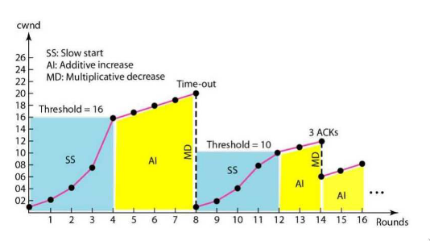

# 9 Lezione -- Reti di Calcolatori

---

<!-- TOC -->
- [Recap lezione prima](#recap-lezione-prima)
<!-- /TOC -->

---

Fine lezioni piu' o meno mezzo maggio, poi forse incontri di ripasso prima degli esami

## Recap lezione prima 

* Il ricevente prima di elaborare i dati li mette in un buffer in entrata.  
TCP NON gestisce il bound(?) dei dati --> prende dati dal buffer IN USCITA e li manda a blocchi al destinatario.  
TCP gestisce un flusso di byte.  
* Come evitare di saturare il buffer di destinazione?  
TCP prevede n messaggio di "finestra di ricezione" (flag di controllo).  
Il problema e' che c'e' un ritardo di ricezione (il mittente potrebbe avere gia' mandato altri pacchetti.)  
* I pacchetti duplicati non sono messi nel buffer in entrata o uscita.  
* Problemi del Two-Way Handshake  --> uno di questi e' il fatto che i messaggi non sono legati fra loro.  
* Three-Way Handshake a Sfida : Richiesta --> Numero --> Numero + 1.  

## Chiusura delle connessioni  
  
Non c'e' un protocollo corretto per determinare la chiusura --> non si puo' fare la macchina a stati finiti.  
Problema in informatica teorica che non ammette soluzione: Problema dell'HALT.  

[wiki: halting problem](https://it.wikipedia.org/wiki/Problema_della_terminazione)
  
A manda il messaggio di fine e B risponde. A quando arriva l'ack dice OK risorse tolte.  
Si usa un solo ack ma poi attivo il timer: il canale diventa libero e se arrivano nuovi pacchetti vengono buttati.  
  
La chiusura e' unidirezionale. A chiude verso B e non puo' mandare messaggi ma rimane in ascolto per eventuali altri dati. Chiusura (separata) da A verso B e poi da B verso A (SEPARATE) (slides pg99)  
  
Non e' il canale che e' stato soppresso ma A non e' piu' autorizzato a mandare dati  

## Altro sul TCP  

TCP 

## **CONGESTIONE**

* Congestione o rallentamento? 
* Congestione --> Non quella del casello autostradale perche' prima o poi le macchine se ne vanno.  
  
### Scenario ideale : Due hosts, Modem buffer infinito
Due macchine mittenti e due macchine destinatarie che condividono lo stesso collo di bottiglia.  
Il modem ha un buffer di dimensione infinita.  
Se le macchine inviano a un throughput sueriore il modem andra' piu' lentemente.  
Finche' il traffico e' inferiore a R/2 ok sale, poi sara' messo nel buffer.  
Esiste anche un traffico di ingresso dalla coda e uscita dalla coda. C'e' un asintoto. Quando il traffico arriva a R/2 il ritardo arriva ad infinito (TEORICO).  

### Due hosts, buffer del modem finito

LambdaIn >= LambdaIn' dove LambdaIn' contiene original data PLUS retransmitted data.  
Delta di ritardo per le ritrasmissioni. Ulteriori delta di ritrasmissioni non necessarie. Piu' ci avviciniamo alla congestione piu' andiamo ancora piu' vicini alla congestione.  
Il canale in se' non e' congestionato ma e' la rete congestionata perche' i buffer si sono riempiti. Buffer pieno vuol dire forte ritardo per la destinazione. Se il timeout scade vengono ritrasmessi i pacchetti che intasano ancora di piu' la congestione.   

### Scenario 3 -- vedi slide

Nota:  Nei sistemi p2p upload e download sono molto simili, mentre nei sistemi di ADSL il download e' molto piu' grande. Nei canali di upload vengono mandati gli ack.  
  
### Approcci riguardo il controllo di congestione  

I router lavorano al livello 3 mentre gli host a livello 4 e non si parlano. La rete sa che c'e' casino ma non puo' dire nulla --> a meno che ..  

Ci sono due bit nell'header TCP che vengono cambiati dai router (violazione del sistema di rete e devono andare al sistema di trasporto dal sistema di rete). Sa che deve andare a settare quei bit. Conosce l'intestazione ma non "lavora" a livello di trasporto propriamente.  

A questo punto le macchine fanno la cosa migliore: fermarsi e fermare i pacchetti che sono mandati. Potrebbero anche cambiare strada, quella e' la modalita' dei circuiti virtuali.  

I protocolli seguenti non sono alternativi ma possono essere usati assieme.  
  
### Approccio AIMD: Incremento additivo, decremento moltiplicativo

**Congestion window**: e' la dimensione della finestra di trasmissione. Quella della GoBackN e' fissa, qui e' variabile. Rappresenta **quanti segmenti posso spedire senza/prima di avere l'ACK di ritorno**.  **Finestra di trasmissione del send**. E' una variabile.  
  
Qui si parla di segmenti ma in realta' nell'implementa rappresenta quanti byte va avanti.  
  
TCP non sa il limite della rete: manda 10. gli arriva un ack, allora ne manda 11, arriva ack poi 12, etc. I pacchetti quindi superano la window. Quando arriva alla congestione e quindi capisco che c'e' un problema rallento di colpo e dimezzo la finestra di congestione.  
  
### Approccio Slow Start
  
Definisco una soglia (slow start threshold). Se sei al di sotto della soglia fai incremento esponenziale, se sei sopra la soglia fai incremento lineare. 

  

Se avessero fatto solo esponenziale avrebbe sparato su pacchetti. Poi quando arrivo alla threshold e la supero vado pianino in maniera lineare. La soglia inizialmente e' predefinita all'inizio: il threshold/soglia diventa la meta' del valore piu' alto e si riparte da zero ma si riparte esponenzialmente.  

### Due versione del TCP: Tahoe, Reno

**Tahoe** 
1. Slow start
2. Congestion Avoidance
3. Fast retrasmit algorithms

Riparte sempre da 0.  

**Reno**
1. Slow start
2. Congestion Avoidance
3. Fast retrasmit algorithms
4. **Fast recovery** --> Timeout riparte da 1, 3 ACK duplicati riparte dalla soglia con la AIMD e non riparto dal valore basso in questo caso.    

### implementazione  

Quando la connessione inizia, l'increase rate aumenta esponenzialmente.  1 pacchetto, 2, poi quattro pacchetti, poi 8.  

### Simulatore e grafi : Tahoe Vs Reno  
  
In sostanza il Tahoe funziona ma il Reno conviene, MA non si usa 
  
Oggi si usa altro anche perche' i mezzi sono diversi: per un canale da 10Gb non arrivero' alla saturazione con lo slowstart. BIC usa incremento cubico.  
  
In ogni caso Reno e Tahoe e NewReno comunicano anche se uno sara' piu' performante dell'altro.  
  
Se ho server e client preferisco mettere quella piu' performante nel server.  
  
TCP Sack --> Incompatibile con le altre. I pacchetti fuori sequenza li tengo. Ma se riesco a dire al mittente cosa manca allora il mittente sa' cosa manca e li rispedisce tutti subito. Selective Acknowledgement. Ha bisogno di modifiche sia al sender sia al receiver.   
   
### Perche' Vegas non si usa?  
Di solito il TCP --> Quando ci sono delle connessioni sgomita.  
Vegas e' un protocollo "Educato" che aspetta e cerca di vedere cosa fanno anche gli altri. Invece di sgomitare si tira indietro. (La informazione che ha e' quanto velocemente stanno tornando i pacchetti)   
Se tutti funzionassero cosi' funzionerebbe ma assieme agli altri TCP NON funziona perche' viene messo da parte. Lacrimuccia  
  
