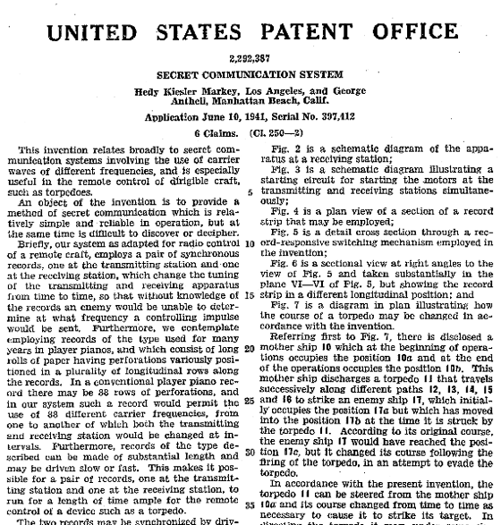

# 16 Lezione -- Reti di Calcolatori 

---
<!-- TOC -->
- [Error Connection  (recap)](#error-connection--recap)
- [Accesso al canale -- Accesso multiplo](#accesso-al-canale----accesso-multiplo)
- [Pure ALOHA](#pure-aloha)
    - [**CSMA Protocols** (Carrier Sense Multiple Access)](#csma-protocols-carrier-sense-multiple-access)
    - [**CSMA/CD (CSMA Con collision detection)**](#csmacd-csma-con-collision-detection)
    - [Protocolllo senza collisione](#protocolllo-senza-collisione)
- [Taking Turns protocols](#taking-turns-protocols)
<!-- /TOC -->
---

## Error Connection  (recap)
  
Distanze dispari --> vanno bene nella correzione degli errori.  
Hamming code. ?   
--> Distanza = numero di bit differenti. La distanza e' anche calcolata con il minimo valore delle distanze esistenti.  
  
vocabolario con 4 elementi --> 2^6 e scelgo solo 4 words  --> vocabolario vuol dire che usa solo quelle 4 codewords.  vocabolario distanza 3.  
  
Piu' si alza il numero delle codewords piu' si alza il numero di possibili errori?   
  
se trovo una codewords che non c'e' --> errore! Allora minimo serve un codice a distanza 3. puo' capitare il fatto che arrivi una codeword sbagliata e equidistante per errore dagli altri --> In quel caso non so come procedere perche' non posso dire quale parola fosse in origine.  

---

## Accesso al canale -- Accesso multiplo

Se e' punto-punto non c'e' un problema di accesso al canale, e se e' full duplex non c'e' problema di chi parli perhce' possono ascoltare entrambi.  
  
Half-duplex: si devono mettere d'accordo.  --> Radio
Invece Ethernet il dispositivo puo' contemporaneamente parlare e ascoltare.  
  
--> Indirizzi livello DLL per specificare con chi si sta comunicando.  
  
Sistema cablato, wireless, satellite...   
  
Accesso al canale "Cocktail party" ??? "Macchinetta del caffe'"  
  

TDMA --> Time Division Multiple Access
    Problemi: devo sapere chi e' presente per dare i turni.
FDMA --> Frequency Division Multiple Access
    Invece di essere fatto sul tempo e' fatto sullo spazio 
    Uso frequenze differenti per conversazioni differenti ma se invece di usare solo rosso o solo verde avessimo tutti i colori --> Rallenterei la comunicazione di chi sta parlando, troppe cose?? E ! Chi usa quale colore?
CDMA --> Code Division Multiple Access  
    Tutti contemporaneamente su tutte le frequenze per tutto il tempo ma c'e' qualcosa che impedisce che le cose si impaccino a vicenda  
      
**Hedy Lamarr** ! Di origine tedesca --> scappo' in america e fece questo brevetto con un pianista?? --> Schema stato pensato per poter radioguidare i siluri in mare in guerra.  
  
[wikipedia page di hedy lamarr](https://it.wikipedia.org/wiki/Hedy_Lamarr)

Serviva uno schema sicuro di comunicazione. --> Fu riutilizzato quando hanno tirato fuori il WIFI.  
  
Timbro che marchia una trasmissione, e in base a questo marchio riconosco la informazione anche se qualcun'altro sta scrivendo sul canale contemporaneamnete 

Ogni singola comunicazione ha la banda limitata.  
  
## Pure ALOHA

Modello di reti wireless anni 60s. Nelle Hawaii --> Tante isolette separate. Mettere in comunicazione le isole senza passare il cavo (fondale molto profondo).  
  
Una antenna nell'isola centrale e tante periferiche nelle isole secondarie. Ma --> La antenna centrale ha 2 canali separati, 1 per ascoltare 1 per trasmettere. Banda divisa gia' in 2.  
  
Quando parla quella centrale, le periferiche ascoltano. No problema di accesso. Quando la centrale ascolta tutti possono parlare.  
  
La antenna centrale ascoltava, prendeva il risultato, lo ritrasmetteva --> Ripetitore in tempo reale senza decodifica.  
  
Verifica di collisione quando le periferiche vedevano che c'era un messaggio ripetuto.  
  
Le prestazioni erano basse. Il canale usato al 18% del suo potenziale.  
  
QUindi realizzare **SLOTTED ALOHA**  
  
Serve qualcosa che scandisca il tempo. --> Per metter assieme gli slots.  
  
Segnale di **BEACON** dall'antenna centrale per segnalare quando parlare agli altri.  
  
### **CSMA Protocols** (Carrier Sense Multiple Access)  
  

  
CSMA --> **Non persistent** --> Lancia un dado e aspetta un tempo random prima di parlare. La usa Ethernet ma la usa anche il WIFI

CSMA --> **0.01 persistent** CSMA? Sembra il migliore  
Probabilita' 0.01 parlo . Funziona bene perche' NON FUNZIONA BENE (Elimina il traffico perche' ne butta 99%)  
  
### **CSMA/CD (CSMA Con collision detection)**  
  
In CSMA normale non e' detto che rilevo la collisione nel senso che devo ritrasmettere --> Ma qui si rileva la collisione immediatamente e so gia' subito che devo ritrasmettere.  
  
Okay individuiamo le collisioni ma quando riprendiamo? --> lanciare dado. Se c'e' collisione di nuovo raddoppio la grandezza del dado. prima 1d6, poi 1d12, etc
Ogni macchina ha il proprio dado  --> sistema distribuito. Ognuno ne puo' usare di diverso  
    
Un secondo di prenotazione --> poi tanti secondi quanti sono quelli che hanno prenotato durante il secondo di prenotazione, numerati.  
  
segnale jamming 

Dimensione minima delle frames ethernet e' 64 byte. (metafora strada 2.5km e 4 amplificatori in mezzo)  
  
### Protocolllo senza collisione 
--> CSMA / BA (Bitwise Arbitration) (Canbus? )
  
Utilizzare il mac-address a bit e mano a mano --> Se qualcuno deve mettere zero e qualcuno ha gia' messo 1 --> allora non metto zero  
Ma quindi alcuni mac address saranno inerentemente privilegiati rispetto ad altri.  
  
Ma riescoa sfruttare questa cosa ??? i guess???  
  
## Taking Turns protocols  
  
Token bus e token ring!   
Token bus funzionava con un unico mezzo che girava per tutta la rete --> il permesso (token) girava con un messaggio lungo tutto il cavo.  
  
Ma posso anche mettere priorita' di traffico. e calcolare il tempo di giro del token.  
  
E' facile uscire dal ring ma come fanno le macchine a entrare?  
  
Ogni macchina vede quanto c'e' stato il giro --> Broadcast per chiedere chi deve parlare. --> collisione oops  
  
Se la macchina con il token "muore" --> la macchina dopo lo genera. ma quella prima non era morta ma ritardva --> 2 token. Si cancellano contemporaneamente --> Casino   
  
DEPRECATO anche se prevede cose carine come la ricevuta di consegna  
  
(Veniva utilizzato per aziende con telecontrollo delle comunicazioni)  
  
lunedi' lezione di reti per gli mz
martedi' dipartimento chiuso 
mercoledi' teoria e forse esercitazione in lab
venerdi' lab  
lunedi' dopo forse esercitazione  
  

