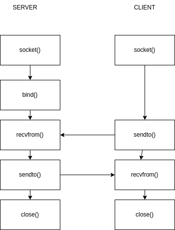

# LAB 4 -- Reti di Calcolatori 

---

<!-- TOC -->
- [Socket di Berkeley](#socket-di-berkeley)
<!-- /TOC -->

---

## Socket di Berkeley
Ci interessano:  
* Gli indirizzi IP delle macchine  
* Numero delle porte di entrambe le macchine
  
* Guarda diagramma 

## Definizione di un socket

```c
struct sockaddr{
    u_short sa_family;
    char sa_data[14];
}
```

```c
struct sockaddr_in{
    short int sin_family; //AF_INET
    unsigned short int sin_port;
        ////////
}
```

## Conversione degli indirizzi

* pton => presentation to network
* ntop => network to presentation  

Consentono di convertire gli indirizzi da leggibile per noi a leggibile per le macchine e viceversa  

* Funzioni utili per conversioni degli interi

## Socket

la chiamata ```socket()``` restituisce un identificatore di socket e serve per creare un collegamento tra client e server. restituisce un negativo in caso di errore. Dominio (IPv4, IPv6), Tipo, Famiglia (Protocollo)  

```c
int bind( int socket, struct sockaddr * addr, int addrlen)
```   
Serve a dire al SO di riservare una PORTA per un processo.  Se la porta e' occupata ritorna un errore e mettiamo un'altra porta.  
Prende in input int socket, struct del sockaddress (numero di porta)  e address lenght.  

### sendto - recvfrom 

```c
int sendto(int socket, void * buffer, size_t size, int flags, struct sockaddr * addr, size_t lenght);

int recvfrom (int socket, void * buffer, size_t size, int flags, struct sockaddr * addr, size_t * lenght);
```
queste operano come send e recv ma sono utilizzate per le trasmissioni senza connessione.  nel primo mettiamo l'indirizzo di destinazione mentre nella recvfrom il campo indirizzo viene riempito con quello del mittente.  

### close

```c
int close(int socket);
```

---

Dobbiamo prima progettare  
> Parte client e parte server. 
> Dobbiamo avviare prima il server o il client?
Con TCP prima il server sicuro.  Con UDP anche entrambi. Durante l'esame MEGLIO PRIMA IL SERVER.  

mettiamo clone di debian e in rete --> rete solo host 
a noi non interessa la prima scheda di rete ma quella solo di rete per trasferire codice.  

* per trasferire file da due macchine : 
```scp [fonte] [destinazione]```   
es:  
``` scp SenderAL.c user@INDIRIZZOIPDELL'USER:/home/user```

[es1](./labConnessioneDiRete/lab3-1.drawio.png) 
  

Client che vuole registrarsi -- invia usernTextame e password, server usa queste info e le memorizza in un file di testo. l'utente puo fre registrazione, login, cancellazione, e il server deve registrare tutto (bisogna anche usare il file). Esami vecchi: Solo la parte UDP. Non la parte di sistemare la rete.  
  
